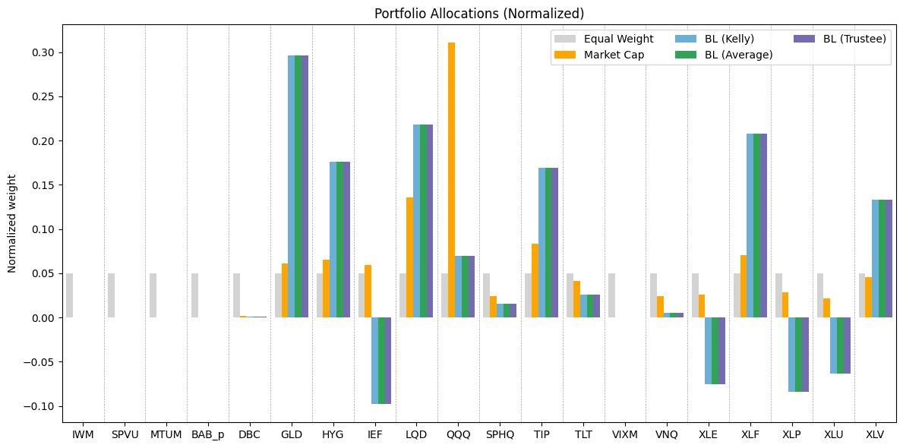

# Black–Litterman Portfolio Optimization with Factor Assets

📌 Implementation of the Black–Litterman (BL) model for portfolio construction, combining  
market equilibrium returns with subjective views. The project integrates factor-based asset  
selection, covariance estimation, constrained portfolio optimization, and backtesting.

---

## Project Structure

1. **Asset and Factor Selection**  
   1.1 Investment Universe  
       1.1.1 Data and preprocessing  
   1.2 Investable Factor Assets  
         1.2.1 The Fama–French Model  
         1.2.2 Extra Factors  
         1.2.3 Factor data and preprocessing  
         1.2.4 Selection rules for proxy ETFs  
         1.2.5 Performance analysis and rolling factor loadings  
   1.3 Final asset set and covariance estimation  

2. **The Black–Litterman Model**  
   2.1 Model formulation  
   2.2 Model implementation  
         2.2.1 Equilibrium return  
         2.2.2 Views definition  
         2.2.3 Views uncertainty  
         2.2.4 Posterior returns and unconstrained BL allocation  

3. **Constrained Portfolio Optimization**  
   3.1 Optimization methods  
   3.2 Optimization results  
         3.2.1 Performance metrics  
         3.2.2 Allocation comparison  
         3.2.3 Risk contributions  
         3.2.4 Performance statistics  
         3.2.5 Portfolio exposures  

---

## Example Results

Allocation comparison between different optimization methods

---

## Repo Contents
- `black_litterman.ipynb` – main implementation notebook  
- `requirements.txt` – dependencies  
- `Outputs/` – selected plots (correlation matrix, allocation comparison, risk contributions)  
- `report.pdf` – extended theoretical discussion and detailed results  

---

## How to Run

- The notebook is self-contained and designed to run autonomously.
- Some input files are fetched directly in code, while others (e.g., factors and risk-free rate time series) must be placed in the `Data/` folder.
- Source for each input data file can be found in the introduction of the notebook.

## Notes

- Plots, printed outputs, and theoretical explanations are omitted from the notebook for readability.  
  A detailed discussion of results is provided in the accompanying **PDF report**.
- Notation conventions:
  - Dates follow `YY-MM-DD`.
  - Weekly returns are used for computations; results are annualized.
  - Vectors/matrices in bold; transpose as prime ($'$); identity as $\mathbb{I}$.

